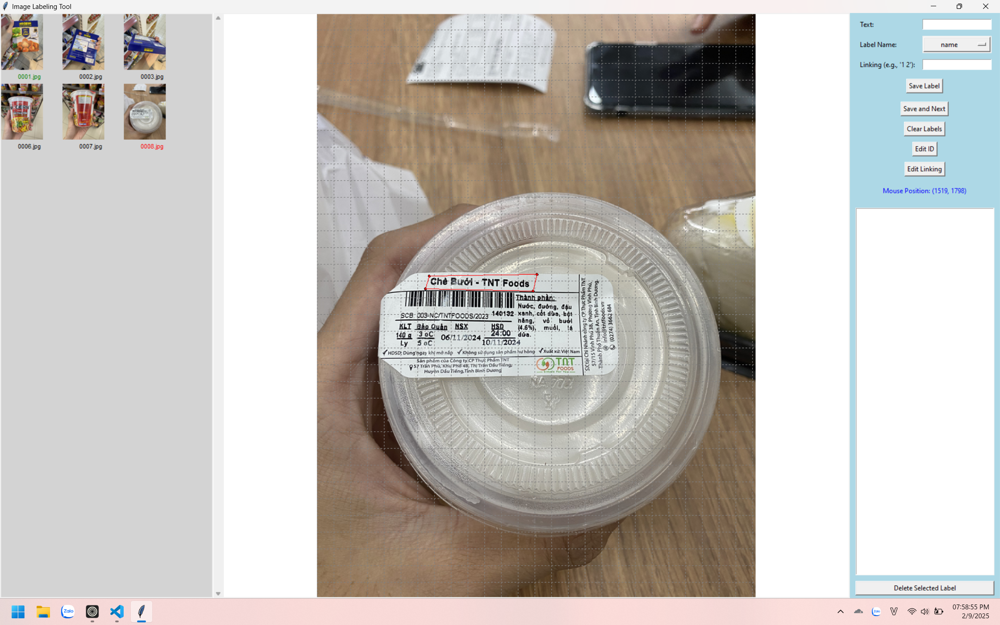
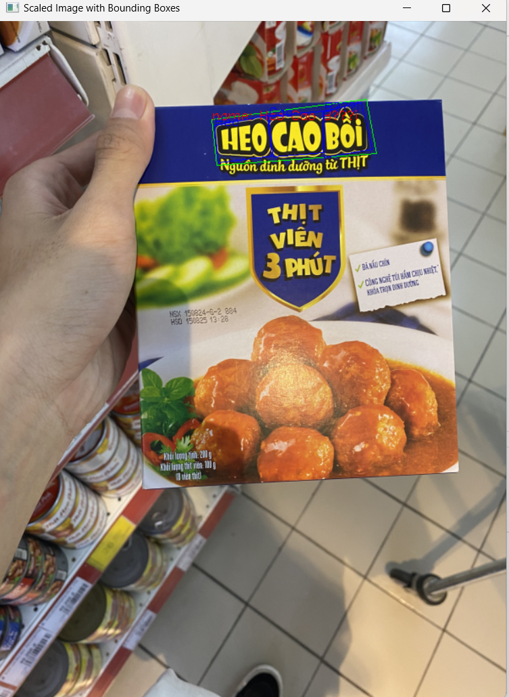

# Image Labeling Tool - README

## Giới thiệu

Image Labeling Tool là một ứng dụng hỗ trợ gán nhãn (label) cho project [GeoLayoutLM](https://github.com/AlibabaResearch/AdvancedLiterateMachinery/tree/main/DocumentUnderstanding/GeoLayoutLM).

## Yêu cầu hệ thống

-   **Python**: Phiên bản 3.6 trở lên.
-   **Các thư viện Python cần thiết**:
    -   `tkinter`: Giao diện đồ họa.
    -   `Pillow`: Xử lý ảnh.
    -   `json`: Lưu trữ và đọc dữ liệu JSON.

### Cài đặt môi trường

1. **Clone mã nguồn từ GitHub**:
   Mở terminal hoặc command prompt và chạy lệnh sau để tải mã nguồn về máy tính:

    ```bash
    git clone https://github.com/htrnguyen/image_labeling_tool.git
    ```

2. **Di chuyển vào thư mục dự án**:
   Sau khi clone xong, di chuyển vào thư mục chứa mã nguồn bằng lệnh:

    ```bash
    cd image_labeling_tool
    ```

3. **Cài đặt các thư viện cần thiết**:
   Cài đặt các thư viện Python cần thiết bằng lệnh sau:

    ```bash
    pip install -r requirements.txt
    ```

## Hướng dẫn cài đặt và sử dụng

### 1. Chuẩn bị dữ liệu

-   Tạo hai thư mục trong cùng thư mục với mã nguồn:

    -   `images`: Chứa các ảnh cần gán nhãn.
    -   `output`: Lưu trữ các file JSON đầu ra chứa thông tin gán nhãn.

    **Lưu ý**: Đảm bảo rằng các ảnh có định dạng `.png`, `.jpg`, hoặc `.jpeg`.

### 2. Chạy ứng dụng

-   Mở terminal hoặc command prompt tại thư mục chứa mã nguồn.
-   Chạy lệnh sau để khởi động ứng dụng:

    ```bash
    python app.py
    ```

-   Ứng dụng sẽ mở ở chế độ full màn hình với giao diện được chia thành ba phần chính:
    -   **Cột trái**: Hiển thị danh sách ảnh (timeline).
    -   **Cột giữa**: Hiển thị ảnh hiện tại để gán nhãn.
    -   **Cột phải**: Các nút chức năng và bảng nhập thông tin.

---

## Chức năng chính

### 1. Quản lý ảnh

-   **Tải danh sách ảnh**: Ảnh trong thư mục `images` sẽ tự động được tải vào timeline.
-   **Chọn ảnh**: Nhấp chuột vào thumbnail để chọn và hiển thị ảnh trên canvas.
-   **Hiển thị trạng thái gán nhãn**: Thumbnail của ảnh đã được gán nhãn sẽ hiển thị màu xanh lá cây.

### 2. Vẽ bounding box

-   **Vẽ bounding box tổng**:
    -   Nhấp chuột trái 4 lần để vẽ một bounding box bao quanh đối tượng.
    -   Bounding box sẽ tự động đóng lại sau khi vẽ đủ 4 điểm.
-   **Vẽ bounding box cho từng từ**:
    -   Sau khi nhập văn bản, nếu văn bản có nhiều từ, ứng dụng sẽ yêu cầu bạn vẽ bounding box cho từng từ.

### 3. Nhập thông tin

-   **Text**: Nhập nội dung văn bản của đối tượng.
-   **Label Name**: Nhập tên nhãn (ví dụ: "title", "paragraph").
-   **Linking**: Nhập thông tin liên kết giữa các đối tượng (nếu có). Định dạng: `"1 2"` (liên kết ID 1 và ID 2).

### 4. Lưu và quản lý nhãn

-   **Lưu nhãn**: Nhấn nút "Save Label" để lưu nhãn hiện tại.
-   **Xóa nhãn**: Nhấn nút "Delete Selected Label" để xóa nhãn đã chọn.
-   **Sửa ID**: Nhấn nút "Edit ID" để thay đổi ID của nhãn.
-   **Sửa Linking**: Nhấn nút "Edit Linking" để cập nhật thông tin liên kết.
-   **Xóa tất cả nhãn**: Nhấn nút "Clear Labels" để xóa toàn bộ nhãn của ảnh hiện tại.

### 5. Di chuyển giữa các ảnh

-   **Lưu và chuyển sang ảnh tiếp theo**: Nhấn nút "Save and Next" để lưu nhãn hiện tại và chuyển sang ảnh kế tiếp.
-   **Quay lại nhãn trước đó**: Nhấn nút "Undo Last Label" để hủy bỏ nhãn cuối cùng.

### 6. Hỗ trợ thời gian thực

-   **Hiển thị tọa độ chuột**: Khi di chuyển chuột trên ảnh, tọa độ gốc của ảnh sẽ được hiển thị ở góc dưới bên phải.

### 7. Xoay ảnh

-   **Xoay trái**: Nhấn nút "Rotate Left" để xoay ảnh sang trái 90 độ.
-   **Xoay phải**: Nhấn nút "Rotate Right" để xoay ảnh sang phải 90 độ.

### 8. Zoom ảnh

-   **Zoom in/out**: Sử dụng con lăn chuột để phóng to hoặc thu nhỏ ảnh.
-   **Pan ảnh**: Nhấn và giữ chuột giữa để di chuyển ảnh khi đang phóng to.

## File đầu ra

-   Mỗi ảnh sẽ có một file JSON tương ứng trong thư mục `output`. Tên file có dạng `<tên_ảnh>.json`.
-   Cấu trúc JSON:
    ```json
    {
      "form": [
        {
          "box": [[x1, y1], [x2, y2], [x3, y3], [x4, y4]],
          "text": "Nội dung văn bản",
          "label": "Tên nhãn",
          "words": [
            {
              "text": "Từ 1",
              "box": [[x1, y1], [x2, y2], [x3, y3], [x4, y4]]
            },
            {
              "text": "Từ 2",
              "box": [[x1, y1], [x2, y2], [x3, y3], [x4, y4]]
            }
          ],
          "id": 1,
          "linking": [[id1, id2]]
        }
      ]
    }
    ```

## Demo

Demo `app.py`


Demo `draw_label_on_image.py`

